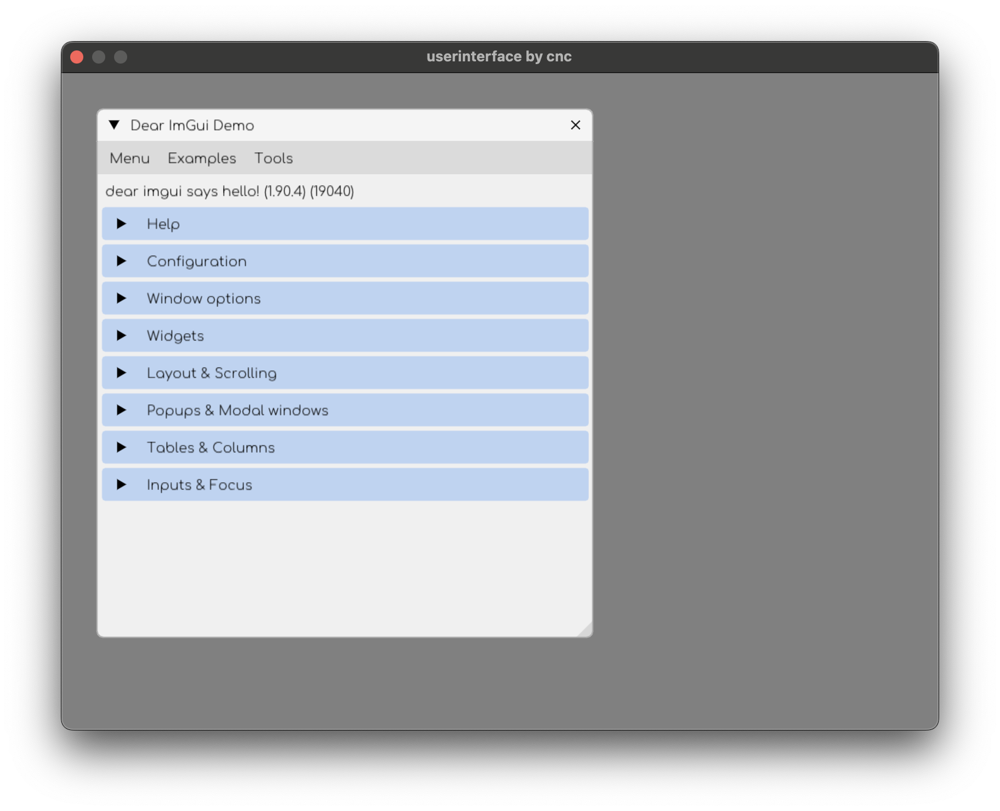

## ImGui demo app for MacOS

This project builds a MacOS window showing the ImGui demo with the following concepts:
- creating an applicaiton object
- creating a window
- drawing with a constant frame rate
- two stage unity build
- setting up ImGui
- git submodules

## What you need

All you need to follow along or just build this project is:

- Visual Studio Code
- XCode command line tools (not XCode itself)
- [cloc to measure lines of code](https://formulae.brew.sh/formula/cloc)

## VS Code extensions   

The following VS Code extensions are also partly necessary:

- [C/C++ Extension Pack](https://marketplace.visualstudio.com/items?itemName=ms-vscode.cpptools-extension-pack)
- [C/C++ Clang Command Adapter](https://marketplace.visualstudio.com/items?itemName=mitaki28.vscode-clang)
- [Metal Shader Extension for Visual Studio Code](https://marketplace.visualstudio.com/items?itemName=doublebuffer.metal-shader)

## How to build and run

In order to build the project clone this repository and update the submodule *libs/imgui* with<br>
```git submodule update --init```<br>

Then run ```sh build.sh ALL``` once to get ImGui to build into an object file. Every subsequent build only requires<br>
```sh build.sh``` <br>

In order to run execute <br>
```./userinterface```